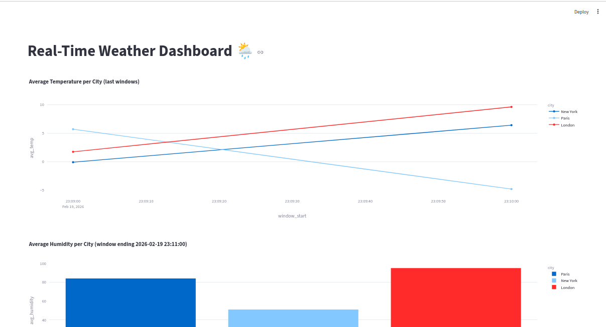
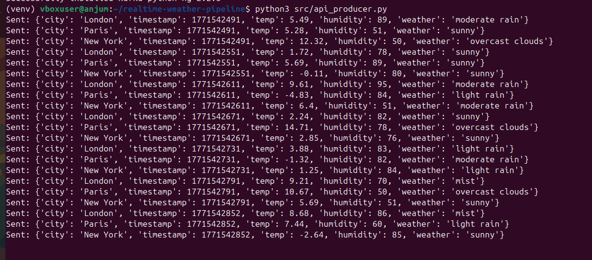
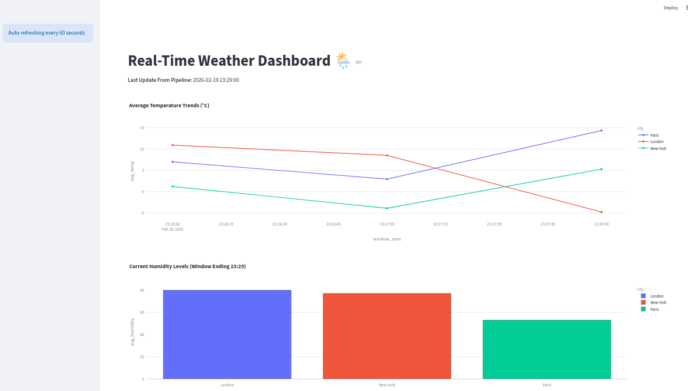
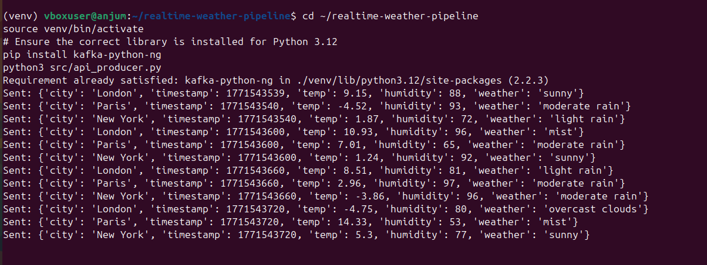
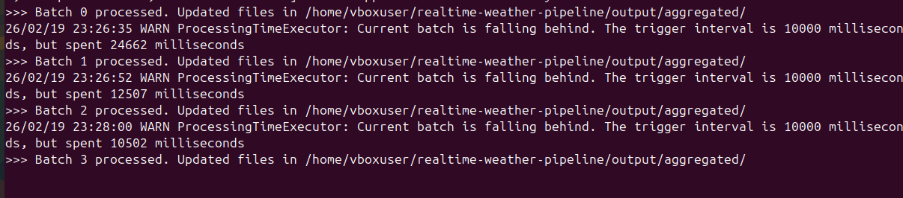
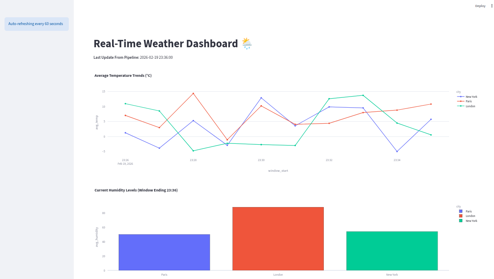
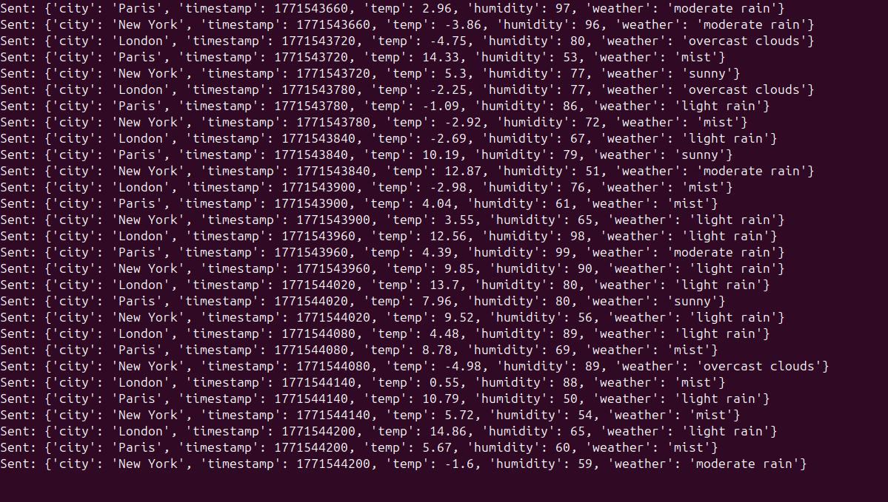
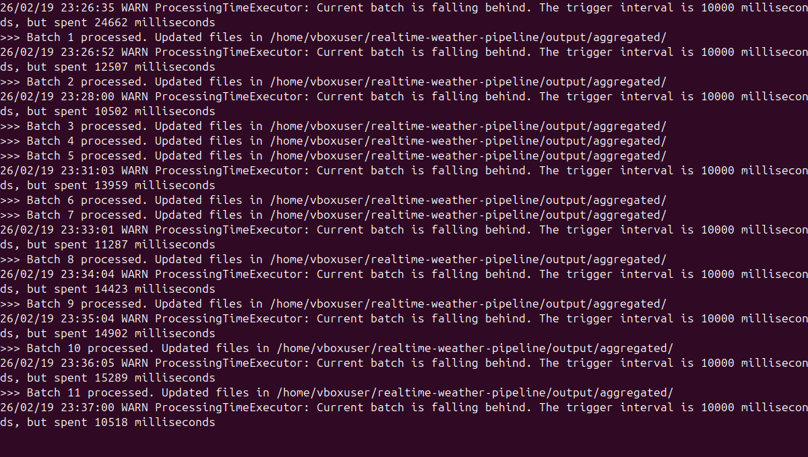

🌦️ Real-Time Weather Data Pipeline

An end-to-end real-time data engineering pipeline that ingests live weather data, performs stream processing with aggregations, stores results efficiently, and visualizes trends dynamically.

🏗️ Architecture
Component	                         Technology	                           Purpose
Data Source	                OpenWeatherMap API (simulated)	        Provides live weather data
Message Broker	                Apache Kafka (Dockerized)	    High-throughput ingestion and buffering
Stream Processing	        Apache Spark Structured Streaming	Windowed aggregation of data (1-minute intervals)
Storage	                                Parquet Files	          Efficient analytical storage for processed data
Visualization	                    Streamlit + Plotly          	Interactive real-time dashboards

🚀 Getting Started

1️⃣ Prerequisites

    - Docker & Docker Compose

    - Apache Spark 3.4.1+

    - Python 3.12+

    - Virtual Environment (venv)

2️⃣ Infrastructure Setup

    Start Kafka and Zookeeper using Docker Compose:

        cd docker
        docker-compose up -d

3️⃣ Python Dependencies

    Activate your virtual environment and install required packages:

        source venv/bin/activate
        pip install kafka-python-ng pandas pyarrow streamlit streamlit-autorefresh plotly requests

🏃 Running the Pipeline

The full system involves four components running concurrently. Open separate terminals for each:

    - Terminal 1: Kafka Producer

        Simulates live weather data and pushes it to the weather_data Kafka topic:

        python3 src/api_producer.py

    - Terminal 2: Spark Aggregator

        Processes raw JSON data from Kafka into 1-minute aggregated metrics:

        spark-submit --packages org.apache.spark:spark-sql-kafka-0-10_2.12:3.5.0 src/weather_aggregator.py
    
    - Terminal 3: Streamlit Dashboard

        Visualizes the processed data interactively at http://localhost:8501
        :

        streamlit run dashboard/dashboard.py

📈 Dashboard Features

    - Temperature Trends: Real-time line chart of average temperature per city.

    - Humidity Metrics: Bar chart comparing humidity levels across locations.

    - Auto-Refresh: Updates every 60 seconds to align with Spark processing intervals.

    - Data Persistence: Uses Parquet files, ensuring data remains available even if the dashboard restarts.

🛠️ Troubleshooting

    - Kafka Connection Errors:

        If you see NoBrokersAvailable, ensure the Docker container is running and port 9092 is accessible.

    - Python 3.12 Compatibility:

        Use kafka-python-ng instead of the standard kafka-python to avoid version-related issues.

    - Duplicate Element IDs in Streamlit:

        Ensure each st.plotly_chart has a unique key argument to prevent rendering conflicts.

